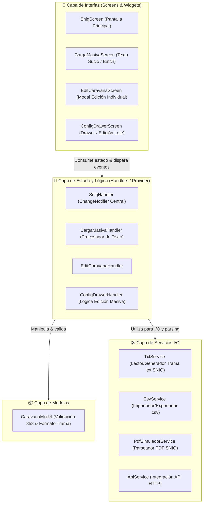
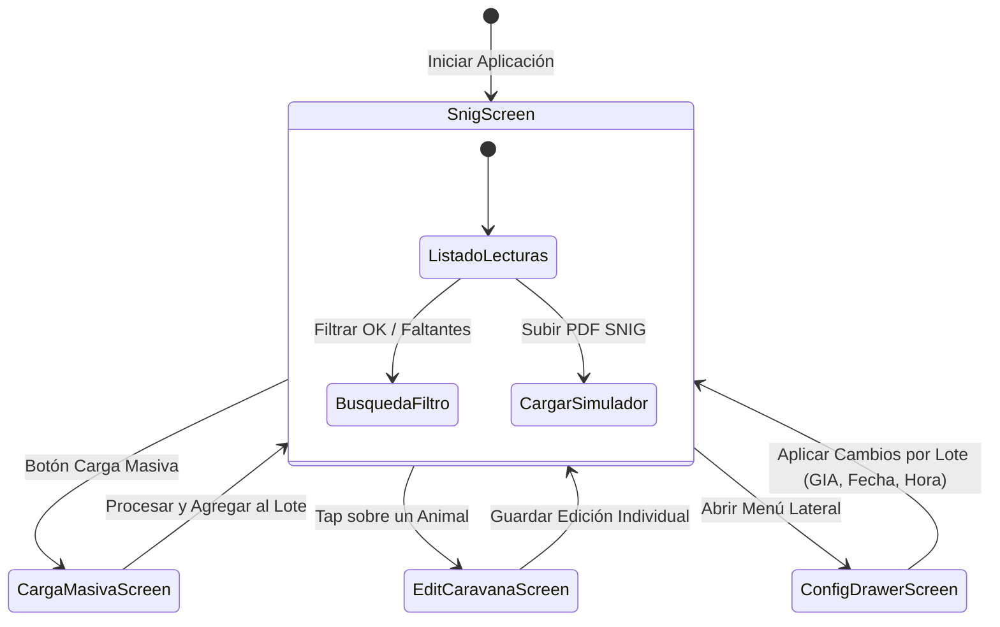

# 🐄 SNIG Connect (FormatearCaravana)

**Solución integral multiplataforma para la gestión, validación y formateo de lecturas de caravanas electrónicas (EID) enfocada en el Sistema Nacional de Información Ganadera (SNIG - Uruguay).**

Este proyecto nació originalmente como un script de Python para formatear lecturas, pero ha evolucionado hacia una **Aplicación Flutter completa (Android / iOS / Web / Desktop)** diseñada específicamente para el trabajo de campo (mangas y tubos).

---

## 🗺 Diagramas del Sistema

### 1. 🏗 Arquitectura del Proyecto (Patrón Provider)
Representación de la separación de responsabilidades entre la UI, los gestores de estado (Handlers), los modelos de datos y los servicios I/O.



---

### 2. 🔄 Flujo de Procesamiento y Validación de Lecturas
Muestra el recorrido de la información desde su captura en campo hasta la exportación de la trama oficial del SNIG.

```mermaid
flowchart TD
    subgraph Fuentes ["📥 Fuentes de Entrada"]
        A1[CSV de Balanzas / Lector Tru-Test]
        A2[Texto Sucio / Mensaje WhatsApp]
        A3[Ingreso Manual Directo]
    end

    subgraph Procesamiento ["⚙️ Procesamiento & Normalización"]
        B1[CsvService: Lectura de Filas]
        B2[CargaMasivaHandler: Extracción Regex & Horas Correlativas]
        B3[CaravanaModel: Autocompletado ISO 858]
    end

    subgraph Validacion ["🔍 Motor de Validación SNIG"]
        C1{¿Cumple Reglamento?}
        C2[15 dígitos numéricos?]
        C3[Comienza con '858' Uruguay?]
    end

    subgraph Comparacion ["📊 Comparación con Simulador"]
        D1[Carga PDF / TXT Oficial SNIG]
        D2[PdfSimuladorService: Extraer EIDs]
        D3[Cruce en Tiempo Real con Lectura Actual]
    end

    subgraph Salida ["📤 Salida & Exportación"]
        E1[🟢 Estado OK / 🔴 Estado Faltante]
        E2[TxtService: Generar Trama [|A000...|]]
        E3[CsvService: Exportar Registro Completo]
    end

    A1 --> B1
    A2 --> B2
    A3 --> B3

    B1 --> C1
    B2 --> C1
    B3 --> C1

    C1 -->|Sí| C2 & C3
    C1 -->|No| F[Error de Formato / Rechazo]

    C2 & C3 --> G[Instancia CaravanaModel Válida]
    G --> SnigHandler[SnigHandler - Estado Global]

    D1 --> D2 --> D3
    SnigHandler --> D3
    D3 --> E1
    SnigHandler --> E2 & E3
```

---

### 3. 📱 Mapa de Pantallas y Navegación
Flujo de usuario e interacción entre las diferentes vistas de la aplicación.



---

## 📂 Estructura del Proyecto Explicada

A continuación se detalla la jerarquía del código fuente dentro de `fonten_flutter/lib`, comentando la responsabilidad específica de cada módulo para facilitar la mantenibilidad y reutilización como plantilla de arquitectura:

```txt
lib/
├── core/                         # Configuración central del sistema y diseño visual
│   └── theme/
│       ├── app_styles.dart       # Definición de constantes visuales, colores de estado (OK/Faltante), bordes y estilos
│       └── app_theme.dart        # ThemeData global de Flutter (Paletas claro/oscuro, tipografías y componentes)
│
├── models/                       # Modelos de datos del dominio
│   └── caravana_models.dart      # CaravanaModel: Entidad principal. Reglas de validación ISO 858 (15 dígitos),
│                                 # conversiones a/desde trama SNIG [|A000...|] y serialización JSON.
│
├── screens/                      # Capa de Interfaz de Usuario (UI) organizada por características
│   ├── carga_masiva/             # Módulo para procesamiento de texto masivo / WhatsApp
│   │   ├── carga_masiva_handler.dart  # Handler (Provider): Lógica para extraer caravanas de texto sucio y generar horas secuenciales
│   │   ├── carga_masiva_screen.dart   # Vista UI: Campo de texto enriquecido y botón de importación
│   │   └── widgets/
│   │       └── temp_caravana_item.dart # Widget item: Previsualización de caravanas extraídas antes de confirmar
│   │
│   ├── config_drawer/            # Módulo de menú lateral y edición por lote
│   │   ├── config_drawer_handler.dart # Handler (Provider): Aplicación masiva de GIA, fecha y horas correlativas
│   │   └── config_drawer_screen.dart  # Vista UI (Drawer): Panel de ajustes globales y acciones por lote
│   │
│   ├── edit_caravana/            # Módulo de edición individual rápida
│   │   ├── edit_caravana_handler.dart # Handler (Provider): Estado de edición temporal de un animal
│   │   └── edit_caravana_screen.dart  # Vista UI (Modal/Pop-up): Formulario de ajuste de datos de una caravana
│   │
│   └── snig/                     # Módulo principal de trabajo con caravanas
│       ├── caravana_item.dart    # Widget item: Tarjeta visual para renderizar cada caravana (badge verde/rojo, checkbox)
│       ├── snig_handler.dart     # Handler Central (Provider): Mantiene la lista activa, estados de comparación y filtros
│       └── snig_screen.dart      # Vista UI Principal: Lista de lecturas, contadores, barra de búsqueda y acciones
│
├── services/                     # Capa de Servicios I/O, almacenamiento y parsing de archivos
│   ├── api_service.dart          # Integración HTTP con API backend externas o consultas SNIG
│   ├── base_service.dart         # Clase base abstracta de servicios con utilidades de red y manejo de excepciones
│   ├── csv_service.dart          # Lector/Escritor de archivos .csv (Compatibilidad con lectores RFID Tru-Test Data Link)
│   ├── descarte.dart             # Filtro/Helper para la gestión de lecturas descartadas o duplicadas
│   ├── pdf-simulador_service.dart# Extrae números EID desde archivos PDF oficiales generados por el simulador del SNIG
│   └── txt_service.dart          # Parsea y genera archivos de texto plano (.txt) con el formato exacto de trama SNIG
│
└── main.dart                     # Punto de entrada de la aplicación. Configura la lista de MultiProvider y la navegación base
```

---

## 📱 Propuesta de Valor

Los lectores RFID (ej. Tru-Test XRS-2) generan archivos que las aplicaciones por defecto exportan en formatos no compatibles directamente con las plataformas oficiales. **SNIG Connect** elimina la carga manual y la manipulación de Excel, permitiendo al operario transformar, validar y comparar lecturas en su celular, **100% offline**, garantizando que la información esté lista para subir al portal oficial sin errores.

## ✨ Funcionalidades Principales

### 📥 Carga y Extracción Inteligente
* **Importación CSV:** Soporte directo para archivos generados por balanzas y lectores (Tru-Test Data Link).
* **Procesador "Texto Sucio" (WhatsApp):** Algoritmo inteligente que extrae números de caravana desde mensajes de texto pegados, ignorando letras, DICOSEs y guiones.
* **Ingreso Manual Optimizado:** Autocompletado inteligente. Si el usuario digita el número visual (ej. `12345`), el sistema lo transforma al estándar ISO de 15 dígitos uruguayo (`858000000001234`).

### 🔍 Simulación y Validación (SNIG)
* **Comparador de Simulador:** Carga un PDF o TXT oficial del SNIG y comparalo en tiempo real con la lectura actual. La interfaz marcará visualmente los animales **OK (Verde)** y los **Faltantes (Rojo)**.
* **Validación Estricta:** Motor de validación que asegura la integridad de la trama ISO (Exactamente 15 dígitos, prefijo `858`, solo valores numéricos).

### 🛠 Edición y Gestión de Lote
* **Edición Masiva:** Menú lateral para cambiar rápidamente la GIA (Guía), Fecha y Hora de todo un lote de animales seleccionado.
* **Edición Individual:** Pop-up ágil para modificar datos específicos de un animal directamente desde la lista.
* **Horas Correlativas:** Al procesar textos masivos, el sistema asigna horas de lectura secuenciales con intervalos aleatorios realistas (simulando el paso por el tubo).

### 📤 Exportación
* Exportación directa al formato de trama oficial `.txt` (`[|A000...|]`).

---

## 🏗 Arquitectura y Tecnologías

La aplicación está construida utilizando **Flutter** y **Dart**, siguiendo principios de código limpio y arquitectura escalable:

* **Separación de Responsabilidades (UI vs Lógica):** Uso estricto de `StatelessWidget` para la interfaz visual y clases `ChangeNotifier` (Handlers) para la lógica de negocio.
* **State Management:** Implementación del patrón Observer mediante `Provider`.
* **Multiplataforma:** Lógica condicional (`kIsWeb`) para manejar el procesamiento de archivos nativo (Path/Streams) en móviles/escritorio, y lectura en memoria (Bytes) en navegadores web.

---

## 🚀 Instalación y Uso (Desarrolladores)

### Requisitos Previos
* [Flutter SDK](https://docs.flutter.dev/get-started/install) (v3.22 o superior).
* Android Studio (para compilar en Android).
* Visual Studio 2022 con C++ (para compilar el ejecutable de Windows).

### Clonar y Ejecutar

1. Clona el repositorio:
   ```bash
   git clone https://github.com/AryGimenez/FormatearCaravana.git
   cd FormatearCaravana/fonten_flutter
   ```

2. Instala las dependencias de Flutter:
   ```bash
   flutter pub get
   ```

### Ejecutar en Desarrollo

**Para Windows:**
Asegúrate de tener habilitado el soporte para escritorio (Visual Studio con herramientas de C++) y ejecuta:
```bash
flutter run -d windows
```

**Para Linux:**
Asegúrate de tener instaladas las dependencias de desarrollo (CMake, Ninja, GTK, pkg-config, etc.) y ejecuta:
```bash
flutter run -d linux
```

---

## 🐳 Despliegue con Docker (Web App)

Si deseas hostear **SNIG Connect** como una aplicación web, puedes construir un contenedor Docker. Esto compila la versión web de Flutter y la sirve mediante un servidor ligero (como Nginx).

### Pasos para compilar y ejecutar el contenedor

1. **Construir la imagen de Docker:**
   Sitúate en el directorio `FormatearCaravana/fonten_flutter` (donde se encuentra el `Dockerfile`) y ejecuta el siguiente comando para crear la imagen:
   ```bash
   docker build -t snig-connect-web .
   ```

2. **Ejecutar el contenedor:**
   Una vez que la imagen termine de construirse, levanta el contenedor mapeando el puerto web (por ejemplo, el 8080):
   ```bash
   docker run -d -p 8080:80 --name mi-snig-connect snig-connect-web
   ```

3. **Acceder a la aplicación:**
   Abre tu navegador web e ingresa a `http://localhost:8080`. ¡La versión web de la aplicación estará funcionando y lista para usarse!